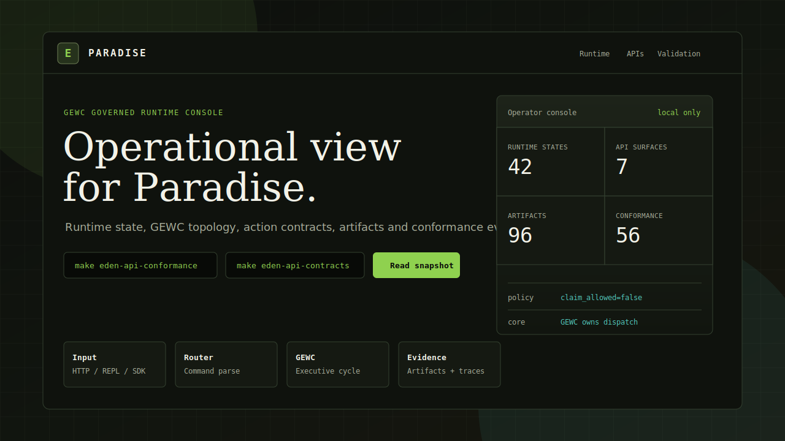
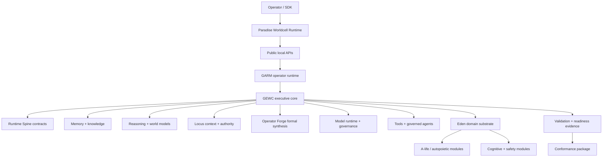

# Paradise

Paradise is a governed local runtime from the Eden project for autonomous
cognitive systems.

It gives agents a bounded world before they touch the real world: context,
authority, memory, simulation, permission gates, action contracts and evidence.

In plain English: Paradise gives autonomous agents a governed local workspace
where plans, permissions, actions, evidence and rollback paths are visible
before the system touches real files, tools or APIs.

Paradise is not a completed AGI, not the full Eden organism, and not a trained
production LLM/LMM. It is a local-first runtime for making autonomous work
inspectable, permissioned, reversible and evidence-bearing.

[![GARM Verify][garm-verify-badge]][garm-verify-workflow]
![Rust][rust-badge]
![Claims][claims-badge]
![API][api-badge]



## The Worldcell Loop

```text
Intent
  -> Locus context + authority
  -> Cognitive field: memory + goals + risk + world state
  -> GEWC executive decision
  -> Operator Forge action contract
  -> World-model simulation
  -> Safety and permission gate
  -> Runtime body execution
  -> Evidence memory
  -> Safe learning
```

Generate the current Paradise Worldcell evidence locally:

```bash
cargo run -p eden_core --bin paradise -- worldcell
```

The command writes `paradise_worldcell_runtime.json` in the selected state
directory and keeps `claim_allowed=false` and `agi_claim=false`.

Plan an action without touching files, tools or APIs:

```bash
cargo run -p eden_core --bin paradise -- run --dry-run "inspect runtime status safely"
```

That command records intent, produces a dry-run plan and writes a reviewable
`paradise_worldcell_sessions.json` session. It does not execute the candidate
action.

Run a complete local Worldcell session without model training or external
network access:

```bash
make paradise-operational-loop
```

That loop records an intent, plans a dry-run, asks for explicit approval,
executes only a safe standalone runtime action, then writes
`paradise_worldcell_sessions.json`.

Run the non-GPU product/runtime readiness gate:

```bash
make contracts-validate
make paradise-non-gpu-readiness
make paradise-checkpoint-registry-smoke
make paradise-release-package
```

This writes `target/paradise_non_gpu_readiness/non_gpu_readiness_report.json`
`target/public_contracts/validation_report.json` and
`target/paradise_release/release_package_manifest.json`, then checks product
docs, schema/OpenAPI manifest shape, model interface authority, dataset
governance, checkpoint registry policy, evaluation/admission policy,
external-public boundaries, hardware-test isolation and known technical debt.
It does not train models, use GPU, admit checkpoints or certify AGI.

Generate the GEWC-owned runtime spine contracts:

```bash
make runtime-spine
```

This writes the common operational substrate that the last Paradise phase now
uses: universal internal messages, append-only event bus, global-state mutation
log, replay spine, verification report, security gates, model-router contract,
memory fabric, world-simulation contract and multiagent coordination contract.

## System Map



## What Problem Does This Solve?

Agents should not act directly on your machine, repository, files or tools just
because a model produced a tool call. Paradise puts a Worldcell between intent
and action.

Every serious action should have:

- context and authority;
- an explicit plan;
- a dry-run or bounded simulation;
- a permission boundary;
- a contract for execution;
- a rollback or recovery path;
- evidence after the action.

Paradise provides the local, inspectable engine behind that idea. It keeps
execution, evidence, validation artifacts, action boundaries and API contracts
visible so operators can inspect what the system did, what it claims, and which
checks still block stronger claims.

The project is useful when you want to test coordination architecture, runtime
governance, validation packaging, SDK/API conformance and operator workflows in
one reproducible Rust workspace.

## How This Relates To Eden

Paradise is the public Worldcell Runtime identity and repository name. Eden is
the broader research and architecture lineage behind it.

Eden is broader than the current public surface. The repository contains:

| Name | Meaning in this repo |
| --- | --- |
| Eden | The wider hybrid architecture: executive cognition, memory, reasoning, governed action, safety and A-life/autopoietic substrates. |
| Paradise | This public repo/product: a bounded Worldcell Runtime for governed autonomous work, local APIs, operator console, validation and release evidence. |
| GARM | The current operator runtime that owns commands, state, reports, packages and local execution surfaces. |
| GEWC | Global Executive Workspace Core: the executive coordination core inside GARM. It routes work, records decisions and applies safety gates. |
| GEWC handlers | Typed runtime domains under GEWC authority. They are not separate cores. |
| Eden Locus Layer | Native GEWC handler for personal context, authority parsing, evidence quarantine, permission boundaries and operator timeline. |
| Eden Operator Forge | Native GEWC handler for typed formal primitive synthesis, expression graph candidates and bounded verification. |
| Conformance packages | Reproducible local evidence that APIs, contracts and policy markers match the published surface. |
| Eden substrate | Broader modules under `eden_core/src/`, including A-life, autopoietic, cognitive, safety, memory, physics and experimental domains. |

The operational GARM/GEWC runtime now lives as native library code under
`eden_core/src/garm/`, with `eden_core/src/bin/eden_garm.rs` as the runtime
binary entry point and `eden_core/examples/eden_garm.rs` retained only as a
compatibility wrapper. See
[`docs/EDEN_SYSTEM_LAYERS.md`](docs/EDEN_SYSTEM_LAYERS.md) for the detailed
layer model and terminology.

## What Is Here

| Layer | Current surface |
| --- | --- |
| Paradise Worldcell | `cargo run -p eden_core --bin paradise -- worldcell`, `cargo run -p eden_core --bin paradise -- run --dry-run ...` and `make paradise-worldcell` write the public Worldcell Runtime and dry-run evidence artifacts. |
| Runtime spine | `runtime spine eval` / `runtime spine enforce` / `runtime spine verify` / `make runtime-spine` writes, guards and verifies universal contracts for messages, event bus, global state, replay, workflow risk, circuit breakers, safety, model routing, memory, simulation and multiagent coordination. |
| Eden substrate | `eden_core/src/` contains the broader Eden modules with mixed maturity. |
| Operator runtime | `eden_core/src/bin/eden_garm.rs` starts the native GARM runtime. |
| Executive core | GEWC owns command routing, body handlers, runtime traces and safety gates. |
| Locus/Forge | `locus ...`, `operator forge ...`, `edenctl locus ...` and `edenctl forge ...` expose governed context authority, formal synthesis artifacts and the Locus/Forge-to-CWM hypothesis bridge. |
| Model runtime | `model runtime eval`, `first model prepare`, `elcp prepare`, `elcp hardening`, `eden capable eval`, `eden capable operationalize` and `model register/load/evaluate/unload ...` expose GEWC-governed model adapter lifecycle, first-model preparation, ELCP latent objective preparation, checkpoint probe routing, cognitive call contracts, eval surfaces, checkpoint manifests, training harness reports and model governance without training or shipping weights. |
| APIs | Runtime state, artifact, operational, capability, validation, GEWC and action-contract APIs. |
| SDK | `eden_core::sdk` provides a lightweight Rust client over the public local API. |
| Training surface | `training/` contains the CPU-safe smoke benchmark, first trainable-memory contract, ELCP cognitive-transition fixtures, ROCm profile and future AMD GPU training entry point. |
| Conformance | `make eden-api-conformance` validates a live endpoint from outside the process through the native `eden-garm-api-conformance` runner. |
| Release evidence | `make eden-api-contracts` writes API artifacts, readiness package and independent validation through the native `eden-garm-package-validator` runner. |
| Operator CLI | `cargo run -p eden_core --bin paradise -- status` is the socket-free public quickstart CLI; `cargo run -p eden_core --bin edenctl -- status` wraps the live local runtime API. |

## Public-Ready Posture

| Area | Status |
| --- | --- |
| License | MIT license added at `LICENSE`. |
| Security | `SECURITY.md` and `docs/THREAT_MODEL.md` define local runtime boundaries. |
| Claim boundary | `docs/CLAIMS_AND_LIMITATIONS.md` blocks unsupported AGI claims. |
| Engineering practices | `docs/EDEN_ENGINEERING_PRACTICES.md` defines review, evidence, contract and safety expectations. |
| Non-GPU readiness | `docs/PARADISE_PRODUCT_SPEC.md`, `docs/PARADISE_MODEL_INTERFACE.md`, `docs/PARADISE_DATASET_GOVERNANCE.md`, `docs/PARADISE_EVALUATION_AND_ADMISSION.md` and `make paradise-non-gpu-readiness` define the non-GPU product/runtime hardening path. |
| Contribution flow | `CONTRIBUTING.md`, issue templates and PR template are present. |
| Release note | `PUBLIC_RELEASE.md` documents the public source checkpoint; no versioned GitHub release has been published. |

## Non-Goals

- Paradise is not presented as a completed AGI system.
- Paradise is not the full Eden architecture packaged as a finished product.
- Local validation artifacts are not external proof of general intelligence.
- The runtime does not train or ship a production LLM/LMM checkpoint today.
- The API server is local-first and is not hardened as an internet-facing
  production service.
- The project does not make autonomous high-risk actions available by default.
- The repository does not claim that every broader Eden module under
  `eden_core/src/` has the same maturity as the public GARM/GEWC surface.

## Quick Start

Five-minute local path, no sockets and no network:

```bash
cargo run -p eden_core --bin paradise -- status
cargo run -p eden_core --bin paradise -- worldcell
cargo run -p eden_core --bin paradise -- run --dry-run "inspect runtime status safely"
```

Expected evidence:

```text
/tmp/paradise/paradise_worldcell_runtime.json
/tmp/paradise/paradise_worldcell_sessions.json
```

Or run the same path through Make:

```bash
make paradise-quickstart
```

Post-quick-start verification:

```bash
test -s /tmp/paradise_quickstart/paradise_worldcell_runtime.json
test -s /tmp/paradise_quickstart/paradise_worldcell_sessions.json
```

Live local API path:

```bash
cargo build --bin eden-garm -p eden_core
cargo run --bin eden-garm -p eden_core
```

Run as a local daemon:

```bash
target/debug/eden-garm \
  --daemon \
  --api-port 8080 \
  --pid-file /tmp/eden_garm.pid \
  --log-file /tmp/eden_garm.log \
  --state-dir /tmp/eden_garm
```

Or use the operator wrapper after building the runtime:

```bash
cargo run -p eden_core --bin edenctl -- start --port 8080 --state-dir /tmp/eden_garm
```

Then open:

```text
http://127.0.0.1:8080/
```

The root endpoint serves the EDEN operator console. Text help remains available
at `/api/help`.

Quick verification after startup:

```bash
curl -fsS http://127.0.0.1:8080/api/help
curl -fsS http://127.0.0.1:8080/api/validation/status
curl -fsS http://127.0.0.1:8080/api/operational/status
curl -fsS 'http://127.0.0.1:8080/api/actions/dry-run?cmd=help'
cargo run -p eden_core --bin edenctl -- status
cargo run -p eden_core --bin edenctl -- doctor
```

A working local startup returns non-empty responses for all commands. The
dry-run endpoint should describe the command path without queueing or executing
the command.

Run a concrete Locus/Forge bridge workflow against a live runtime:

```bash
eden_core/src/garm/operator_examples/06_locus_forge_bridge.sh
```

That script admits governed operator context through Locus, synthesizes and
verifies a bounded Operator Forge candidate, runs `operational runtime eval`,
then reads `locus_operator_bridge` through the runtime-state API. The bridge is
evidence for governed integration only; it does not write directly to memory,
objectives or model weights.

For a scripted local API smoke test, run:

```bash
make smoke-api
```

To generate the Paradise Worldcell Runtime artifact and a full local session
without starting model training:

```bash
make paradise-quickstart
make paradise-worldcell
make paradise-operational-loop
make runtime-spine
```

The normal Rust test suite exercises API routing without opening local sockets,
so it is safe in restricted sandboxes. To validate the real TCP transport
explicitly, run:

```bash
make api-socket-test
```

To validate the future training/evaluation path without requiring a GPU:

```bash
make training-smoke
```

This writes `target/eden_training_smoke/capability_report.json`. The report is
pipeline evidence only; it keeps `claim_allowed=false` and does not claim EDEN
has a trained production LLM/LMM. It also writes a Markdown summary and validates
the JSON report against `contracts/v1/schemas/eden-training-capability-report-v1.json`.

To admit the report as GEWC-governed runtime evidence:

```bash
make training-evidence
```

To validate model adapter lifecycle, checkpoint manifest, harness and governance
without training a production model:

```bash
make model-runtime
```

To prepare the first EDEN model candidate formally without executing training:

```bash
make first-model-prepare
```

To validate EDEN Latent Cognitive Prediction, run a CPU baseline, export
candidate traces, dry-run the training interface and prepare the admission gate
without executing training:

```bash
make elcp-prepare
```

To generate the local EDEN-capable runtime surface without GPU use:

```bash
make eden-capable
make eden-capable-operationalize
```

These commands expose the 7B checkpoint only as a GEWC-subordinate hypothesis
generator, then write the cognitive call contract, capability eval suite,
memory/action loop and operational gate. They do not admit AGI, production
inference or autonomous tool authority.

Hardware and network tests are available separately:

```bash
make external-tests
```

That target requires real GPIO/I2C/network access and is not part of the
sandbox-safe default suite.

To validate the runtime as an external black-box process, run:

```bash
make operational-blackbox
```

Optional local API protection is available for operator workflows:

```bash
export EDEN_API_TOKEN='local-development-token'
cargo run -p eden_core --bin edenctl -- --token "$EDEN_API_TOKEN" status
```

When `EDEN_API_TOKEN` is unset, the API keeps the default local-first behavior.
When it is set, non-public routes require either `Authorization: Bearer <token>`
or `X-EDEN-API-Token: <token>`.

## Operator Console

The static console source lives at:

```text
docs/EDEN_OPERATOR_CONSOLE.html
```

It is also embedded into the GARM API server and served from `/`, `/console` and
`/api/console`. It gives the repo a visual operational surface without adding a
frontend toolchain or network dependency.

## Core Commands

| Goal | Command |
| --- | --- |
| Format check | `make fmt` |
| GARM tests | `make test` |
| API TCP transport test | `make api-socket-test` |
| Operational black-box runtime gate | `make operational-blackbox` |
| Examples and bins | `make check` |
| API smoke tests | `make smoke-api` |
| Model runtime governance | `make model-runtime` |
| First model preparation | `make first-model-prepare` |
| ELCP validation and 4B-prep | `make elcp-hardening`, `make elcp-prepare` |
| Paradise Worldcell evidence | `make paradise-worldcell` |
| Paradise operational loop | `make paradise-operational-loop` |
| Runtime spine contracts | `make runtime-spine` |
| API contract package | `make eden-api-contracts` |
| External API conformance | `make eden-api-conformance` |
| Operational evidence bundle | `make operational-evidence-bundle` |
| Operational demo suite | `make operational-demo-suite` |
| Long-run stability gate | `make long-run-stability` |
| Locus operator API | `cargo run -p eden_core --bin edenctl -- locus ingest "operator preference :: governed context"` |
| Operator Forge API | `cargo run -p eden_core --bin edenctl -- forge synth "causal risk model"` |
| Paradise public CLI | `cargo run -p eden_core --bin paradise -- run --dry-run "inspect runtime status safely"` |
| OpenAPI export from live runtime | `cargo run -p eden_core --bin edenctl -- openapi export --output-dir contracts/v1/openapi` |
| Runtime doctor | `cargo run -p eden_core --bin edenctl -- doctor` |
| Legacy quick verification | `make verify` |
| Full release-candidate gate | `make eden-release-check` |

## Runtime API Families

| Family | Endpoints |
| --- | --- |
| Runtime state | `/api/runtime/catalog`, `/api/runtime/state?name=...`, `/api/runtime/snapshot`, `/api/runtime/openapi` |
| Artifacts | `/api/artifact/catalog`, `/api/artifact?name=...`, `/api/artifact/runtime` |
| Operational | `/api/operational/catalog`, `/api/operational/openapi`, `/api/operational/runtime`, `/api/operational/contract`, `/api/operational/runtime-phase`, `/api/operational/status`, `/api/operational/permissions`, `/api/operational/replay`, `/api/operational/recovery`, `/api/operational/demos`, `/api/operational/schemas` |
| Capability | `/api/capabilities/catalog`, `/api/capabilities/status` |
| GEWC | `/api/gewc/runtime`, `/api/gewc/handlers` |
| Validation | `/api/validation/status` |
| Action contracts | `/api/actions/contracts`, `/api/actions/dry-run?cmd=...` |

Mutation remains intentionally narrow:

```text
/api/command?cmd=...
/api/command_sync?cmd=...
POST /api/command
```

Dry-run never queues or executes commands.

## Documentation

| Document | Purpose |
| --- | --- |
| [docs/README.md](docs/README.md) | Documentation index and public-ready handoff. |
| [docs/PARADISE_WORLDCELL_RUNTIME.md](docs/PARADISE_WORLDCELL_RUNTIME.md) | Public Paradise identity and Worldcell Runtime loop. |
| [docs/PARADISE_DEVELOPER_SURFACE.md](docs/PARADISE_DEVELOPER_SURFACE.md) | Public CLI, API, contract, Action and extension boundaries. |
| [docs/demos/paradise-quickstart.md](docs/demos/paradise-quickstart.md) | Short terminal transcript for the public quickstart flow. |
| [docs/EDEN_SYSTEM_LAYERS.md](docs/EDEN_SYSTEM_LAYERS.md) | Layer model and terminology for Paradise, Eden, GARM and GEWC. |
| [docs/EDEN_OPERATOR_CONSOLE.html](docs/EDEN_OPERATOR_CONSOLE.html) | Visual operator console served by the runtime root endpoint. |
| [docs/EDEN_RUNTIME_API_SURFACE.md](docs/EDEN_RUNTIME_API_SURFACE.md) | Runtime, operational, artifact and action API map. |
| [docs/EDEN_PUBLIC_API_V1.md](docs/EDEN_PUBLIC_API_V1.md) | Frozen public v1 runtime/API/command contract. |
| [docs/HOW_TO_BUILD_ON_EDEN.md](docs/HOW_TO_BUILD_ON_EDEN.md) | Integration guide for building tools on the public EDEN surface. |
| [contracts/v1/](contracts/v1/) | Versioned public contract manifest, OpenAPI snapshots, schemas and examples. |
| [docs/releases/v0.1.0-rc1.md](docs/releases/v0.1.0-rc1.md) | Local release-candidate notes and required gate. |
| [docs/EDEN_OPERATIONAL_CONTRACT.md](docs/EDEN_OPERATIONAL_CONTRACT.md) | Health, readiness, degraded-mode, shutdown and action-boundary contract. |
| [docs/EDEN_SDK_CONFORMANCE.md](docs/EDEN_SDK_CONFORMANCE.md) | SDK and live-endpoint conformance contract. |
| [docs/CLAIMS_AND_LIMITATIONS.md](docs/CLAIMS_AND_LIMITATIONS.md) | What can and cannot be claimed publicly. |
| [docs/THREAT_MODEL.md](docs/THREAT_MODEL.md) | Local API, command surface and repository threat model. |
| [docs/PROJECT_STRUCTURE.md](docs/PROJECT_STRUCTURE.md) | Current, legacy and experimental code maturity map. |
| [docs/HISTORY_REWRITE_PLAYBOOK.md](docs/HISTORY_REWRITE_PLAYBOOK.md) | Procedure for future history cleanup before publication. |
| [docs/releases/v0.1.0-public-draft.md](docs/releases/v0.1.0-public-draft.md) | Draft release notes; not a published GitHub release. |
| [docs/decisions/](docs/decisions/) | ADR history for GEWC, APIs, validation and conformance decisions. |
| [eden_core/src/garm/README.md](eden_core/src/garm/README.md) | Detailed runtime command reference. |
| [eden_core/src/garm/operator_examples/](eden_core/src/garm/operator_examples/) | Executable operator workflows using `edenctl`. |

## Policy

EDEN's local validation artifacts are operational evidence, not an AGI claim.
Generated contracts preserve `claim_allowed=false` and `agi_claim=false` until
appropriate external validation exists.

[api-badge]: https://img.shields.io/badge/API-conformance%20checked-167c80?style=for-the-badge
[claims-badge]: https://img.shields.io/badge/claims-no--claim%20gated-16161d?style=for-the-badge
[garm-verify-badge]: https://img.shields.io/github/actions/workflow/status/Sakumiyaz/Paradise/garm-verify.yml?branch=master&label=GARM%20Verify&style=for-the-badge&logo=githubactions&logoColor=white
[garm-verify-workflow]: https://github.com/Sakumiyaz/Paradise/actions/workflows/garm-verify.yml
[rust-badge]: https://img.shields.io/badge/Rust-local--first-b7410e?style=for-the-badge&logo=rust&logoColor=white
